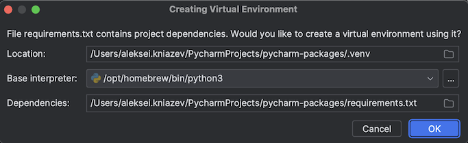

- Open project in PyCharm
  - Click `OK` to create a virtual environment and setup the project
  
- Check if the package `numpy` is installed on the interpreter.
If so, what is the installed version?
- Find out what packages are available to be installed
- Install package `requests`
- After you've lanuched package installation, can you track it's progress? 
Is it clear when the package is installed?
- Update all the packages to the latest versions.
- Delete package `numpy`
- You want to learn more about the package `Flask`, find its description and access documentation. 
How would you do it?
- Install package directly from VCS using this link `<link>`
- Can you modify `Python Packages` tool window location in PyCharm? How would you do it?